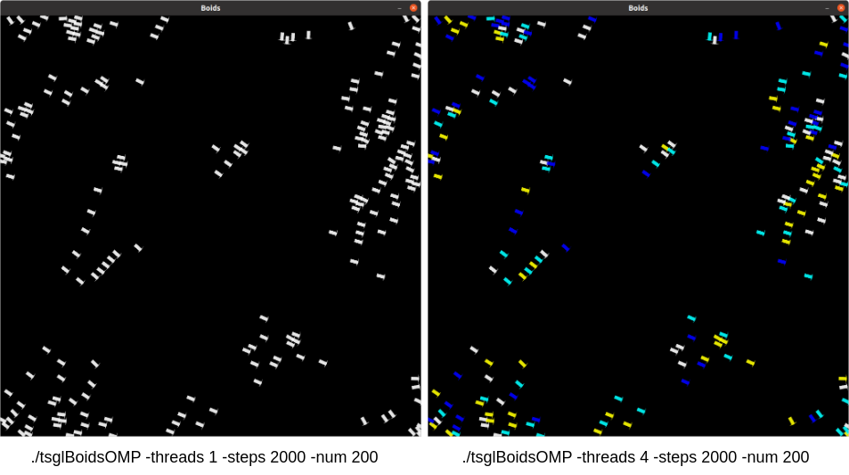

# Simulating Flocking Behavior Using OpenMP and OpenACC

In 1987, Craig Reynolds wrote a paper describing how to model the behavior of flocks of animals for computer graphics. He attempted to simulated birds, coining the graphic version he created bird-oids, or "boids" [[1]](#1). He pointed out that the behavior he modeled also applied to schools of fish and herds of other animals.

This groundbreaking work by Reynolds ushered in the study of individual agents that can exhibit self-organizing behavior and has been cited in other works well over 14,000 times. One such citation is in a book by Gary Flake called *The computational beauty of nature* [[2]](#2). In chapter 16, section 3, Flake describes his implementation of Reynolds' algorithm. We started with Flake's original code when formulating this assignment.

## Brief description

The provided file called *"GaryWilliamFlak_1998_163FlocksHerdsAndScho_TheComputationalBeaut.pdf"* contains the section of Chapter 16  from Flake's book that describes the algorithm that models the boid behavior. A given number of boids are placed randomly on a canvas with a given x and y position and initial velocity, then begin moving according to some rules. Flake used three 'rules' from Reynold's work to apply to each boid as it moved and added a fourth rule of his own. The movement takes place by *simulating time* using a for loop for a relatively arbitrary number of times: each time through the loop, each boid applies the rules by observing the location and speed of every other boid. According to Flake, the rules are:

1. **Avoidance.** Move away from boids that are too close, so as to reduce the chance of in air collisions.
2. **Copy.** Fly in the general direction that the flock is moving by averaging the other boids' velocities and directions.
3. **Center.** Minimize exposure to the flock's exterior by moving toward the perceived center of the flock.
4. **View.** Move laterally away from any boid that blocks the view

More details about weighting each rule and combining them are described in the pdf file.

Flake has functions for displaying the boids as arrows moving at each time step in an X window display. The version you will work with is a revamped  C++  version that uses a library called Thread-Safe Graphics Library (TSGL). This library enables you to visualize how the boids are assigned to threads in a parallel version of the code. A snapshot is shown in Figure 1, where a single thread is used on the left and all boids are white arrows, and 4 threads in an OpenMP version were used on the right, showing a color used for each thread and the boids assigned to that thread.

<figure>
    
    <figcaption>Figure 1. Boids program displays</figcaption>
</figure>

**NOTE:** For the OpenACC GPU version you will complete, the boid colors will stay white, because you will be using many more threads than colors that we can distinguish. In fact, the GPU programming model works on the principle of setting up one thread per data computation, which in this case is a new 'heading' at each time step (see below for details).

## Necessary Background

You may be updating three versions of this program: 1) OpenMP for CPU and 2) OpenACC for multicore, and 3) OpenACC for GPU. You will need practice using the pragmas for the compilers that provide multithreaded capability using both of these specifications.

You need to have studied some examples from OpenMP to be able to apply them to this situation. One reference is the [PDC for Beginners book, chapter 1](https://www.learnpdc.org/PDCBeginners2e/1-sharedMemory/toctree.html), where you can see some OpenMP examples in action. Another is the full set of pattern examples in [Chapter 2 of the Intermediate PDC book](https://www.learnpdc.org/IntermediatePDC/index.html).

To complete an OpenACC version for the GPU, you should study and practice the code examples in Chapters 7 and 8 of [the Intermediate PDC book](https://www.learnpdc.org/IntermediatePDC/index.html). It is also helpful to consider the CUDA GPU Programming model described in [Chapter 4, section 2 of the PDC for Beginners book](https://www.learnpdc.org/PDCBeginners2e/4-cuda/2-cuda-model-dim3.html). The OpenACC compiler creates CUDA code, and the programming model of 1 thread per array data element computation applies here.

To consider the scalability of your parallel solution, you might want to read about how this is determined in PDC programs by reading [PDC for Beginners book, chapter 0, section 3](https://www.learnpdc.org/PDCBeginners2e/0-introduction/3.performance.html).

## Starting Point Code

### Directory: tsgl

The code in the tsgl folder contains a C++ version that uses the TSGL library for display, and is completely revamped from the original code by Flake.

The Makefile is designed to enable you to build 3 different versions of the code from the files in this folder:

- **boidsOMP**:  a version that you can complete by adding OpenMP pragmas
- **boidsMC**:  a version that you can complete by adding OpenACC pragmas to build a multicore version
- **boidsGPU**:  a version that you can complete by adding OpenACC pragmas to build a GPU version

To see how this is done, look at the function *printHello()* in the file tsglBoids.cpp, which is as follows:

    void printHello()
    {
        #if defined(OMP) || defined(MC)
        fprintf(stderr, "Running on the CPU with ");
        #endif

        #if defined(OMP) && !defined(MC)
        fprintf(stderr, "OpenMP!\n");
        #elif defined(MC) && !defined(OMP)
        fprintf(stderr, "OpenACC MultiCore!\n");
        #endif

        #if defined(GPU) && !defined(OMP) && !defined(MC)
        fprintf(stderr, "Running on the GPU with OpenACC GPU!\n");
        #endif
    }

Now have a look in the Makefile to see how the executables are built. For example here is the relevant portion for building the OpenMP version:

    boidsOMP: boids.cpp misc
	    g++ -c -Ofast -fopenmp -Wall boids.cpp misc.o -o boidsOMP.o -DOMP

The use of -DOMP directs the compiler to define a variable OMP, which then can be used inside the code as shown in the *printHello()* funtion above. Notice also how we can cleverly use ||, &&, and ! to create useful checks. 

:bulb: **Tip:**  It will be essential for you to use these defined variables so that you can add different pragma directives for each of the versions that will get built from the same .cpp files.

To build each version, you can do the following:

    make omp       # creates tsglBoidsOMP executable
    make mc        # creates tsglBoidsMC executable
    make gpu       # creates tsglBoidsGPU executable

Currently, all three make a sequential version of the code.

To create all the versions at once, you can use:

    make all

Note that simply typing 'make' only makes the omp version.

Without making any changes, you can use 'make all' and each version will be purely sequential. To know what parameters are available that you can change, type something like this for any version:

    ./tsglBoidsOMP -help

Examples that you can run (close the window to quit):

    ./tsglBoidsOMP -steps 5000 -num 400 -threads 2
    ./tsglBoidsOMP -steps 5000 -num 400 -threads 4
    ./tsglBoidsOMP -steps 5000 -num 400 -threads 8

Note that until you add the parallelism, these all run on one thread. The MC version can be run in a similar way, as well as the GPU version, like this:

    ./tsglBoidsGPU -steps 5000 -num 400

## Study the code

There are two files to study:

- **boids.cpp**      has a function called compute_new_headings() that decides each boid's next position and velocity (its heading) using the rules.
- **tsglboids.cpp**  has main() and supporting functions for running with and without drawing to a display.

The decision made for each boid about where it should move next at each time step is independent-- it uses the current information about the boids near it to simply update its own new position and velocity. What this means is that the computations made for each boid during a particular time step can be executed in parallel.

You should try to observe how this is possible. 1-dimensional arrays are used for current x, y positions and velocities of every boid. Here is the gist of the program:

    for each time step
        compute new headings:
            for each boid
                look at every other boid except myself (another loop)
                use boids near me to determine a *new* heading, kept in separate arrays
        
        once all new headings are computed, 
        for each boid
            copy the new heading values into the arrays holding the curent headings
            draw the boid in its new position
            update boid color if applicable

Use this pseudocode to help you study the existing code. This general method is found in a great deal of simulations that use time steps to update positions and other attributes of each element in the world being modeled.

A key element here to help you decide how to parallelize the code is to recognize what calculations in which loop are independent and why.

## Your goals

You can work on making code changes to add parallelism to one, two, or all three programs.

Add pragmas using a technique something like this:

    #if defined(OMP)
	    #pragma omp ...
	#elif defined(MC)
	    #pragma acc ...
	#elif defined(GPU)
	    #pragma acc ...
	#endif

Note there may be cases where it will be helpful to use && or || or ! with these.

As you study the code, you could try to see why only up to 8 different colors are used for displaying the thread that worked on a boid.

If the displaying is working properly on your version, you can run a small test with small number of boids (e.g. 20) and 50-100 steps, you should end at the same output positions whether using 1 thread or multiple threads for the OMP version. This is also true for the MC version and the GPU version. As you use more boids and more time steps, the final display will likely look different between the three versions.

:bulb: **Hints for GPU:**  We have observed a few important aspects of using OpenACC pragmas on code of this complexity. In addition to describing which loop should be split across all the threads available on the GPU, you should describe which loops should not be run in parallel by using **#pragma acc loop seq** above them. It seems to be necessary to use the clause **collapse(1)** on some outer loops (parallel and sequential) so that the compiler gets a hint from you to not collapse the loop. There is one case where using collapse (2) is useful on one inner nested loop. Another important aspect of using the OpenACC compiler on this code is that it is much better to let it decide when data will need to be moved from the host to the device and back. **In other words, there is no need for pragmas with data directives in this code and using them could cause you problems.**

Test your solution on varying sets of initial conditions. You can start with something you can observe using the display window. Next, for this version on the GPU it is interesting to see how you can scale the program to a much larger world (width, height) and a much larger number of boids than can easily be displayed, so you will want to use the command line argument *-noDraw* as you increase width, height, and number of boids. You can compare times to the OpenMP version under the same conditions. Be sure to try out lots of different conditions to see where the GPU version might be faster. Keep the number of steps at 600 - 800 and vary -width, -height, and -num. At some point, keep width and height fixed fairly large and increase the number of boids with -num. You should see a point where using a large enough number of boids runs faster than using 8 threads on the OpenMP CPU version. 

The code is designed so that you can run it without the display and send output timing data to a file, like this:

    ./tsglBoidsOMP -steps 5000 -num 400 -threads 2 -noDraw >> timing_outfile.txt

You may want to update what gets printed if you want to run several tests using a script.

## Write a report

You should report on your solutions and what you have learned about the scalability of them. This should be the kind of report you might write to someone interested in the changes you made and/or how well it performs, including when it is best to use the GPU. You need to provide enough detail that a reader of your report can repeat your work.

## Criteria for grading of report

Make a useful, well-written report that describes your code optimizations and the results. Below are some items you should include. You can choose the order in which you present the following ideas in your report, using sections with headers.

- Devise a title for your report.
- Include your name (own your work!)

- Explain briefly what problem you are analyzing and optimizing- orient the reader of your report to the problem.

- Explain the code updates that you made.

- Explain what command line argument(s) you ultimately decided to vary in your experiments. This constitutes your 'problem size' that you change and obtain timing results for, using each version. Explain how you changed it and your observations about performance as it varied.

- Write about the experiments you tried that did not show much scalability and those that did. Write an explanation of why the GPU version performed the way it did.

- Describe your methodology: how many times you ran your experiments and what conditions you used (i.e. cases you tried). Sometimes a table is useful for this.

- You should show regular speedup curves for the OpenMP version for several problem sizes.

- The concept of speedup is different for code on accelerators. Using many smaller, slower cores speeds up code in a different way so that traditional speedup does not apply. Use other methods to show the change in speed, such as bar charts that compare each of the versions for varying problem sizes. 

- Ultimately, what did you learn by parallelizing this example with these different compilers and the difference between the fast CPU and slower cores on the GPU?

## References
<a id="1">[1]</a>
Reynolds, Craig W. (1987)
Flocks, herds and schools: A distributed behavioral model.
Proceedings of the 14th annual conference on Computer graphics and interactive techniques, 25-34.

<a id="2">[2]</a>
Flake, Gary William (2000)
The computational beauty of nature: Computer explorations of fractals, chaos, complex systems, and adaptation.
MIT Press. 270-278
