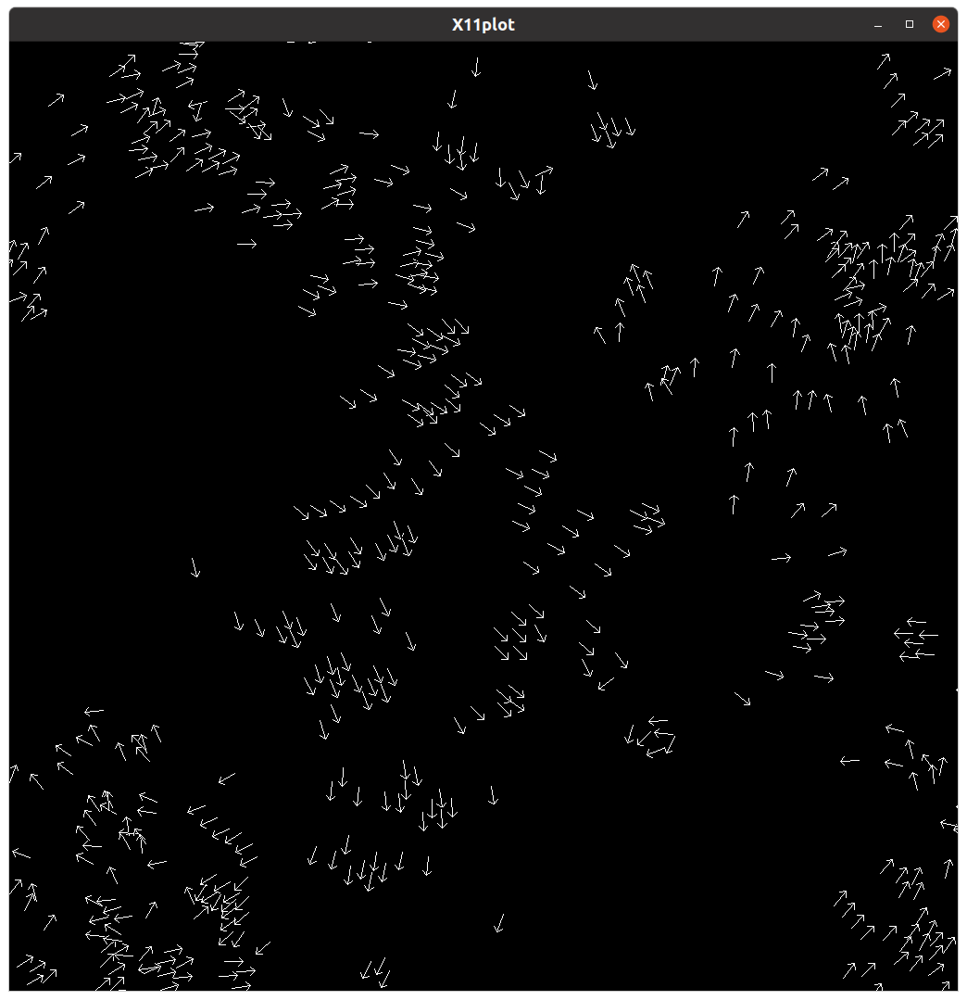

# Simulating Flocking Behavior

In 1987, Craig Reynolds wrote a paper describing how to model the behavior of flocks of animals for computer graphics. He attempted to simulated birds, coining the graphic version he created bird-oids, or "boids" [[1]](#1). He pointed out that the behavior he modeled also applied to schools of fish and herds of other animals.

This groundbreaking work by Reynolds ushered in the study of individual agents that can exhibit self-organizing behavior and has been cited in other works well over 14,000 times. One such citation is in a book by Gary Flake called *The computational beauty of nature* [[2]](#2). In chapter 16, section 3, Flake describes his implementation of Reynolds' algorithm. We started with Flake's original code when formulating this assignment.

## Brief description

The provided file called *"GaryWilliamFlak_1998_163FlocksHerdsAndScho_TheComputationalBeaut.pdf"* contains the section of Chapter 16  from Flake's book that describes the algorithm that models the boid behavior. A given number of boids are placed randomly on a canvas with a given x and y position and initial velocity, then begin moving according to some rules. Flake used three 'rules' from Reynold's work to apply to each boid as it moved and added a fourth rule of his own. The movement takes place by *simulating time* using a for loop for a relatively arbitrary number of times: each time through the loop, each boid applies the rules by observing the location and speed of every other boid. According to Flake, the rules are:

1. **Avoidance.** Move away from boids that are too close, so as to reduce the chance of in air collisions.
2. **Copy.** Fly in the general direction that the flock is moving by averaging the other boids' velocities and directions.
3. **Center.** Minimize exposure to the flock's exterior by moving toward the perceived center of the flock.
4. **View.** Move laterally away from any boid that blocks the view

More details about weighting each rule and combining them are described in the pdf file.

Flake has functions for displaying the boids as arrows moving at each time step in an X window display. A snapshot is shown in Figure 1.

<figure>
    
    <figcaption>Figure 1. Boids program display</figcaption>
</figure>

## Starting Point Code

### Directory: OMPpsPlot

The code that you will be working with is a revised version of Flake's original code, which contained C code files that enabled an X11 window to display the boids moving on the canvas.

The sequential code file called boids.c, based on Flake's original, is provided. It has been modernized to remove Flake's use of global variables. Here are a few notes about the boids.c code and how to run it.

The Makefile is provided to build the *boids* program. It compiles and links in several other files that are primarily for the display. You shouldn't have to change these and **the file to concentrate on is boids.c**.

compute_new_headings() is the function that applies the rules at each simulated time step.

The main function calls compute_new_headings() for each simulated time step. The number of steps has a large default value of 100000000, so that you can observe the behavior changing over time and see the flocks forming. You can change this and many other parameters- this is described fairly well in the main() function, and some essential parameters are described below. To see what all the parameters are, you can type this in a terminal after you have used 'make' to build the program:

    ./boids -help

Here is one way to run the code with 512 boids and a width and height of 1024 on the display window:

    ./boids -width 1024 -height 1024 -num 512 

The above will take a long time to run, because the number of steps is so large. The ctrl-c combination of characters should stop it. To run it with a certain number of steps, do this:

    ./boids -width 1024 -height 1024 -num 512 -steps 1000

After 1000 steps, the result should look like Figure 1, where you can see that the boids, represented as arrows, have formed groups that are moving in a similar direction.

Eventually, you will want to time your code without showing the display. To do this, add '-term none', like this:

    ./boids -width 1024 -height 1024 -num 512 -steps 1000 -term none

## Your goal
The decision made for each boid about where it should move next at each time step is independent-- it uses the current information about the boids near it to simply update its own new position and velocity. What this means is that the computations made for each boid during a particular time step can be executed in parallel. Multiple threads can split the work of updating each boid's new position, as long as those new positions and velocities are kept separately from the current positions. Once all new positions and velocities have been computed in parallel, then those new positions get copied into the current positions and velocities before starting the next time step.

The boids.c file already has code that sets the number of threads. You do this by using the -t flag, like this:

    ./boids -width 1024 -height 1024 -num 512 -steps 1000 -term none -t 4

**However, you need to add the capability of actually executing part of the code in parallel.**

:bulb: **Tip:** The code also already has timing built in using the OpenMP function omp_get_wtime(). This will enable you to study the scalability of your parallel solution.

**Your main task**: Study the code to find loops and determine which one can be split onto separate threads using the parallel for loop pattern. Add OpenMP pragma(s) to the code.

:bulb: **Tip:** We provide a crude mechanism to test whether the code works with any number of threads by checking what the position of the zeroth boid is at the end (see below). We can see if this is repeatable because we have used a very simple seed for the random number generator that is the same every time we run it. You should be able to see that it is correct from the visualization, also.

    // check for end position of boid 0
	printf("%f, %f\n", xp[0], yp[0]);

Run the program with different scenarios to determine under what conditions the program scales well as you use more threads. In this case, changing the number of steps isn't relevant- just make sure that you use enough so that the flocking behavior is happening and that it runs for several seconds. Other factors are more relevant for determining when the program is scalable by using multiple threads. Noting which loop you ultimately chose to decompose the problem onto multiple threads can help you decide what parameter to change. 

### Write a report

In your report, describe what changes you made to the code to enable running with more than one thread using OpenMP. Where did you choose to put pragmas and why?

Write a description of the scalability of your solution, including under what conditions you see good speedup over using 1 thread.

## Necessary Background

You need to have studied some examples from OpenMP to be able to apply them to this situation. One reference is the [PDC for Beginners book, chapter 1](https://www.learnpdc.org/PDCBeginners2e/1-sharedMemory/toctree.html), where you can see some OpenMP examples in action.

To consider the scalability of your parallel solution, you might want to read about how this is determined in PDC programs by reading [PDC for Beginners book, chapter 0, section 3](https://www.learnpdc.org/PDCBeginners2e/0-introduction/3.performance.html).

## References
<a id="1">[1]</a>
Reynolds, Craig W. (1987)
Flocks, herds and schools: A distributed behavioral model.
Proceedings of the 14th annual conference on Computer graphics and interactive techniques, 25-34.

<a id="2">[2]</a>
Flake, Gary William (2000)
The computational beauty of nature: Computer explorations of fractals, chaos, complex systems, and adaptation.
MIT Press. 270-278
